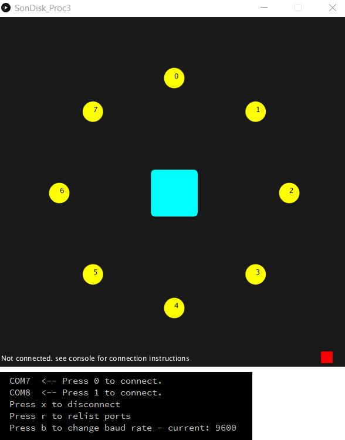

# Sonic Disc Reader
A sample Arduino sketch that demonstrates how to use the SonicDisc when attached via I2C.

Primarily, it is shown how to:
* Initiate SonicDisc measurements
* Read data
* Filter data based on variance

# SonDisk_Proc3
This sketch provides a visual interface for the data produced by SonicDiskReader. Connect an arduino with a SonicDisc to the computer,
and then open the processing sketch. Use the number keys to select the COM port for the arduino, and the output data from SonicDiskReader will be
displayed in a ring.

  

# Smartcar

## Smartcar object follower
A simple sketch that incorporates some business logic to the [SonicDiscReader](../../SonicDiscReader) example and makes a [Smartcar](http://plat.is/smartcar) rotate until it is facing a detected obstacle using the SonicDisc.

The described behavior can be seen in this [video](https://www.youtube.com/watch?v=EGXUQHS0aXI).

## Smartcar Parker
A sketch that allows a [Smartcar](http://plat.is/smartcar) to park between two obstacles using the SonicDisc.

The described behavior can be seen in this [video](https://www.youtube.com/watch?v=V4oNjup3uh4).
